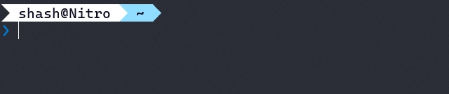
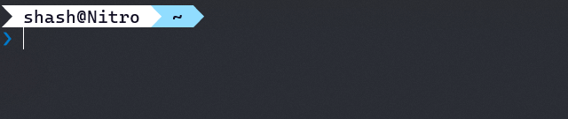
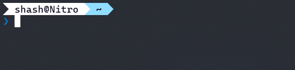

# jot

<a href="LICENSE"></a>
<a href="https://github.com/araekiel/jot/releases/tag/v0.1.0"></a>
<a href="https://crates.io/crates/jt"></a>

<p>
  <a href="#highlights">Highlights</a> •
  <a href="#notes">Notes</a> •
  <a href="#installation">Installation</a> •
  <a href="#usage">Usage</a> •
  <a href="#build-from-source">Build from Source</a> •
  <a href="#authors">Authors</a> •
  <a href="#license">License</a>
</p>


Jot is a CLI tool for managing notes, being built as an alternative to Obsidian. 
<br>
While Obsidian is an excellent knowledge management tool, it often proves to be overkill for my purposes. Plus, the GUI only slows me down. The obvious solution for speed coupled with simplicity (for a programmer) is the terminal. Since Obsidian doesn't have a CLI client or an API that can enable the creation of one, I decided to make a (*in The Primeagen's voice*) blaaaazing fast⚡ and lightweight CLI alternative.
<br>


## Highlights
- Jot is under active development.
- Jot uses files and folders for notes and vaults just like Obsidian.
- Jot is aimed at reducing the time taken to perform tasks, so, each command is a two letter abbreviation of the word(s) that describe it.  

## Notes
- App data is stored in config and data files in locations generated by the [directories](https://crates.io/crates/directories) crate. It is advised that these files not be messed with, since atm there's no way to automatically fix them.
- App config has two fields: *editor* & *conflict*.
    - *editor* by default is set to *nvim* and conflict to *true*.
    - *conflict* field tells the app if the editor conflicts with it for control over the terminal. Set it to *true* for editors like *nvim* and *false* for editors like *notepad*.
- This tool has not been tested on platforms other than Windows as yet.

## Installation

### With cargo

Run the following command to install jot with cargo:

```bash
$ cargo install jt
```

### v0.1.0 Executable Download

[Jot v0.1.0](https://github.com/araekiel/jot/releases/download/v0.1.0/jt.exe) (.exe)

## Commands

### `vl`

Use this command to create a vault.
<br>
This command needs an absolute path (as location for vault) that already exists or it will fail.



Pass in no arguments to get a list of vaults.


Use the *-l* flag to get vaults' locations.


<hr>

### `en`

Use this command to enter a vault.


<hr>

### `nt`

Use this command to create a note in current folder.


<hr>

### `op`

Use this command to open a note.


<hr>

### `fd`

Use this command to create a folder in current folder


<hr>

### `cd`

Use this command to change current folder.


<hr>

### `ls`

Use this command to print dir tree of the current folder


<hr>

### `rm`

Remove an item (*vl*, *nt* or *fd*).


<hr>

### `rn` 

Rename an item (*vl*, *nt* or *fd*).



<hr>

### `mv`

Move an item (*vl*, *nt* or *fd*).


<hr>

### `vm` 

Move an item (*nt* or *fd*) to a different vault.


<hr>

### `cf`

Use this command to get the value of a config field.



Pass in a value along with the above command to set the value of the config field.


<hr>

## Build from Source

### Prerequisites

- Git is need to clone the repository on your machine.
- Cargo is needed to compile the app.

### Installation & Configuration

Clone the repo and cd into the directory: 

```bash
$ git clone https://github.com/araekiel/jot.git
$ cd jot
```

Run the following command to install dependencies and build/compile the app. 

```bash
$ cargo build 
```

Then run the executable created in *target/debug/*.

Or, run the app directly:

```bash
$ cargo run -- *args*
```

Pass in commands and arguments after *'--'*.

## Authors

- **araekiel** - [Github](https://github.com/araekiel)

## License

[MIT License](https://github.com/araekiel/jot/blob/master/LICENSE) | Copyright (c) 2022 Kumar Shashwat
