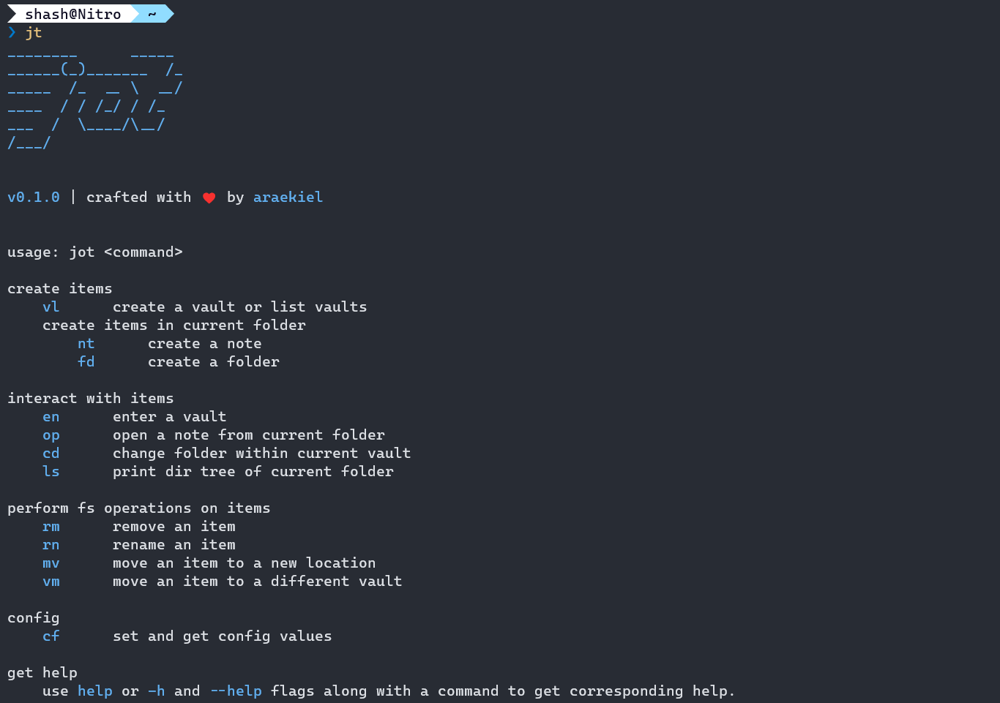

# *jot*

[](https://www.codacy.com/gh/araekiel/jot/dashboard?utm_source=github.com&amp;utm_medium=referral&amp;utm_content=araekiel/jot&amp;utm_campaign=Badge_Grade)
<a href="LICENSE"></a>
<a href="https://github.com/araekiel/jot/releases/tag/v0.1.1"></a>
<a href="https://crates.io/crates/jt"></a>

<p>
  <a href="#installation">Installation</a> •
  <a href="#notes">Notes</a> •
  <a href="#usage">Usage</a> •
  <a href="#changelog">Changelog</a> •
  <a href="#build-from-source">Build from Source</a> •
  <a href="#dependencies">Dependencies</a> •
  <a href="#authors">Authors</a> •
  <a href="#license">License</a>
</p>

***Jot*** is a feature-stripped version of Obsidian focused on rapid note management through the terminal.
<br>
It uses the same format of storage as Obsidian, i.e. markdown files for notes, and local folders for vaults (and sub-folders).
<br>
Commands that encompass all basic needs are included. Each command has an alias (two letter abbreviation) to further increase rapidity. 

<br>



<br>

Jot is under active development. While it contains all basic functions that should serve most needs, there's a laundry list of features that are yet to and will be added overtime.<br>
Check out [***UPDATES.md***](UPDATES.md) to see upcoming updates. ***This project is not open to contributions at the moment.***

## Installation

#### ***Install with cargo:***

```bash
$ cargo install jt
```

#### ***Use executable*** (only for windows)

Download [***jt.exe***](https://github.com/araekiel/jot/releases/download/v0.1.1/jt.exe) (***v0.1.1***) and add it to your path.

## Notes

- App data is stored in config and data files in locations generated by the [***directories***](https://crates.io/crates/directories) crate. Individual Vault data is stored in '***.jot***' folder inside each vault. It is advised that these files not be tampered with, since atm there's no way to automatically fix them.
- App data files are generated in their default state the first time a command is run, if they don't exist already. Vault data files are generated in their default state when a vault is created.
- App config has two fields: ***editor*** & ***conflict***.
    - ***editor*** by default is set to ***nvim*** and ***conflict*** to ***true***.
    - ***conflict*** field tells jot if the editor conflicts with it for control over the terminal. Set it to *true* for editors like *nvim* and *false* for editors like *notepad*.
- Jot is published on ***crates.io*** as '***jt***', since 'jot' wasn't available.

## Usage

The following example represents a general user flow when first using ***Jot***.

#### ***Create a vault using the following command:***

```bash
$ jt vault newvault ~/vaults 
```

Here, ***newvault*** is the name of the vault, and '***~/vault***' is the location where it will be created (this location should be an absolute fs path and exist already or jot will throw an error).

Providing no arguments to `vault` command will list all vaults.

```bash
$ jt vault
```

Adding the '***-l***' flag will list all vaults with their locations. 

```bash
$ jt vault -l
```

At this moment only ***newvault*** will be listed.

#### ***Enter into the vault:***

```bash
$ jt enter newvault
```

`enter` command is also used to switch to other vaults.

#### ***Create notes and folders***

```bash
$ jt note newnote
```

```bash
$ jt folder newfolder
```

`note` and `folder`, both work similarly and create the corresponding items in ***current folder***. When a vault is first created, the ***current folder*** is set to its root.

#### ***Change folder***

```bash
$ jt chdir newfolder
```

`chdir` command will switch the current folder to the location mentioned. 
<br>
Relative path to location from current folder has to be provided. Standard fs paths are accepted as valid input, like '***../folder1/somefolder/***'.

```bash
$ jt chdir ..
```

This will switch back to the root of vault.

#### ***Print dir tree of current folder***

```bash
$ jt list
```

When needed `list` command will print the dir tree of current folder.
All notes will be highlighted in ***blue*** .

This is what the dir tree will look like with this vault's root as the current folder.

```bash
newvault
├── newfolder                      
└── newnote   # highlighted in blue
```

#### ***Fs operations***

Command `remove`  works as its name suggests, on all items (vaults, notes, or folders).

```
$ jt remove note newnote 
```

Commands `rename` and `move` are used similarly but take one additional argument each.

Command `rename` takes the new name as its third argument.

```bash
$ jt rename note newnote somenewnote
```

Command `move` takes the new location as its third argument.

For vaults, path rules are same as `vault` command and for other items, path rules are same as `chdir` command.

```bash
$ jt move note newnote /newfolder/
```

These commands take the item type (***vault***, ***note***, or ***folder***) as their first argument.

Command `vmove` is similar to `move`, but it moves an item (***note*** or ***folder***) from the current folder of the current vault to the root of a different vault, and takes the name of this vault as an argument in place of location.

```bash
$ jt vmove note newnote somevault 
```

Every keyword used so far (commands and item names) is interchangeable with its two letter alias, e.g. `move` command can also be written as:

```
$ jt mv nt newnote /newfolder/
```

#### ***Handle Jot's config***

```bash
$ jt config editor
```

The value of the provided field will be printed with `config` command. Providing a value as an additional argument with this command will update the field. 

```bash
$ jt config editor code.cmd
```

#### ***Get Help***

Run ***jt*** without a command, or with `help` command or ***-h*** flag for main help message.   

```bash
$ jt
```

Use `help` command or ***-h*** flag with a command to get corresponding help.

```
$ jt help vault
```

```
$ jt vault -h
```

## Changelog  

- ***v0.1.1*** :
  - As advised by [***u/epage***](https://www.reddit.com/user/epage/) ([github/epage](https://github.com/epage)) on my r/rust [***post***](https://www.reddit.com/r/rust/comments/xebk9j/i_am_working_on_a_cli_alternative_for_obsidian/), commands are now represented by their full word, and the two letter abbreviations (previously serving as commands themselves) are now aliases for these commands.
  - Updated docs.

## Build from Source

### Prerequisites

- ***Git*** is need to clone the repository on your machine.
- ***Cargo*** is needed to compile the program.

### Build

Clone the repo and cd into the directory: 

```bash
$ git clone https://github.com/araekiel/jot.git
$ cd jot
```

Run the following command to install dependencies and build/compile the program. 

```bash
$ cargo build 
```

Then run the executable created in '***target/debug/***' (or add it to your path).

Or, run the tool directly:

```bash
$ cargo run -- *args*
```

Pass in commands and arguments after '***--***'.

## Dependencies

- [***serde***](https://serde.rs/) & [***toml***](https://docs.rs/toml/latest/toml/) have been used in tandem to read and write data files. 
- [***clap***](https://docs.rs/clap/latest/clap/) has been used to create the command line interface.
- [***directories***](https://docs.rs/directories/latest/directories/) has been used to generate os-dependent config and data file locations.
- [***fs_extra***](https://docs.rs/fs_extra/latest/fs_extra/) has been used for recursive move of folders.

## Authors

- **araekiel** - [Github](https://github.com/araekiel)

## License

[MIT License](https://github.com/araekiel/jot/blob/main/LICENSE) | Copyright (c) 2022 Kumar Shashwat
